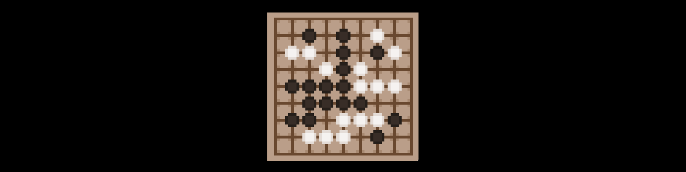

# AlphaGo Zero Implementation

## The Go board (9x9)
Example of a self play game:

This is an implementation of the AlphaGoZero algorithm on a 9x9 Go board, 
but otherwise using essentially all aspects of the original paper (https://doi.org/10.1038/nature24270).

## The setup
### The network

### The training process 

### Future optimization
Probably the biggest gain would be to train longer and parallelize the training process (more games).
The original AGZ paper had 5 million training games (I think implying 1500 games run in parallel over 3 days).
I only had a few hundred training games (since each takes a minute or two).