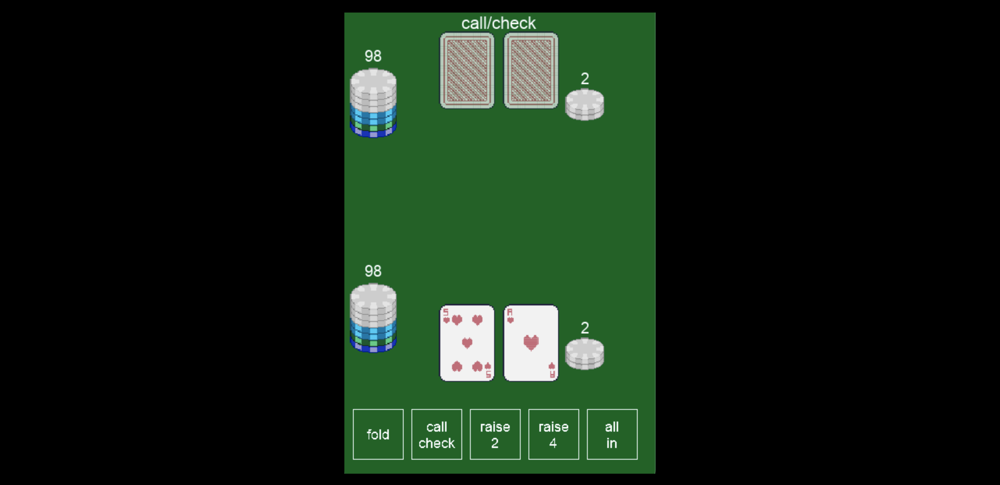
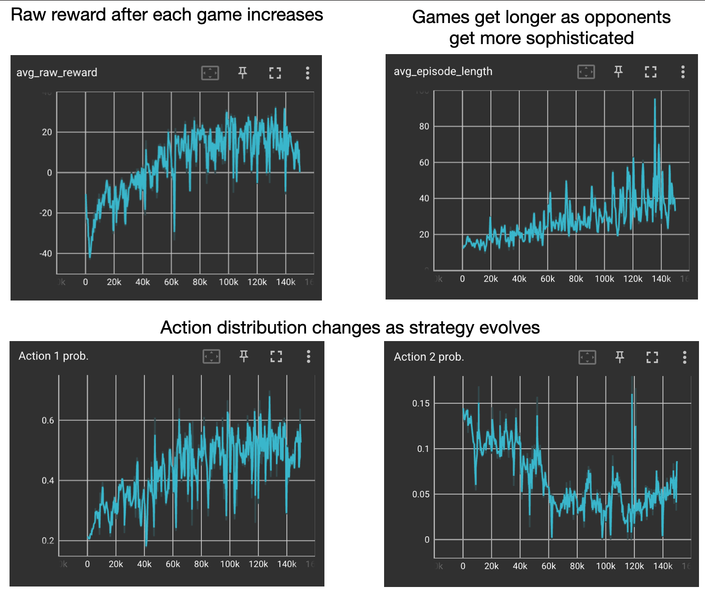
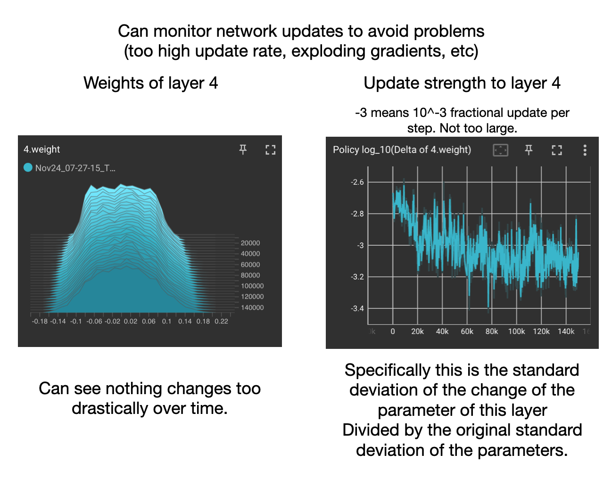
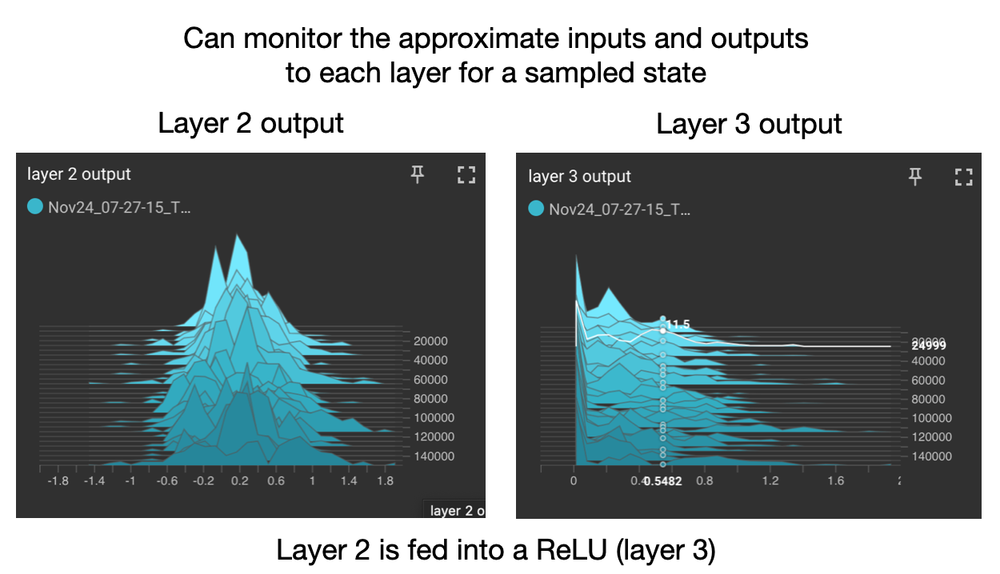

# Poker with Policy Gradients

This is an implementation of a vanilla policy gradient optimization,
with a learned baseline to reduce variance, and entropy regularization (of the action probabilitis).

The agent is trained against an opponent pool of rule-based agents, and past versions of itself, with
opponents selected based on upper confidence bounds on the strength of the opponent 
(the strongest opponents are played most often).

## The game

Two person texas hold em poker. 
Options are fold, call/check, raise some amount, or all in. 


## The files
Main two files are test_model.py and train_network.py. 
* train_network.py is the main training file. 
* test_model.py is just a skeleton of train_network that picks out the code that allows you to run an example.
The network is loaded from a saved version. 

To understand this code, focus on train_network.py. 

## The network 

#### Step 1: state map to features
Given a state of the game, features are crafted from the cards in the hand and pot.
This saves the network from learning things like the structure of hands which are used by the poker rules.
Instead the network can focus on learning the value of various actions. 

#### Step 2: get policy action probabilities and predicted returns
The policy and value networks are each a few layers deep, linear fully-connected layers alternating
with leaky ReLU activations. 
* Value network: one output (the expected discounted returns)
* Policy network: a few outputs (corresponding to each possible action). These are subsequently masked
based on the game rules and the state of the game. 

## Training process 

#### Value network training 
After each episode, the total discounted returns is calculated. 
A value function network is trained to simply predict this return for each state. 

#### Policy network training
The policy network is trained by periodically sampling past memory of the last few games,
and calculating the log probability of the chosen action under the current policy network.  

#### Using an opponent pool
Uses an opponent pool, and a variety of simple rule-based agents to regularize the behavior of the trained network.
Without this opponent pool, the agent learns a local policy optimum (like going all in).

#### Logging the progress  
The training process is observed in a few ways:
* There is an action tracker which records which of the possible actions are taken, and how often.
    * Example output during training (showing stats against each opponent, and average actions chosen):
    ```
     Visit counts: [65. 55. 65. 65. 78. 40. 40. 45. 46.]
      Prob losses: [0.662 0.6   0.662 0.662 0.718 0.5   0.5   0.533 0.543]
      Beta: 0.0398, Reward weighting: 0.099
      Actions chosen: 0: 0.223 1: 0.244 2: 0.106 3: 0.188 4: 0.239
    ```
* The update strengths to the weights and biasess are recorded in tensorboard. 
* The magnitudes of the weights and biases are recorded in tensorboard. 

To see the tensorboard results, run "tensorboard --logdir runs" in terminal.

> Example overall behavior of network during training


> Checking weights and biases have reasonable change over time 
(and slow enough learning rate/small enough update rate)


> Examining input/output for certain layers to make sure it's reasonable

 
## Takeaways 
The main difficulty was getting the agent to not collapse to a trivial strategy. 
Specifically, going all in is a way to go from -1 reward, to an average of 0, but it's not a 
very good global strategy. 
By having a strong opponent pool that would beat this strategy, and annealing the entropy regularization, 
this could be avoided.