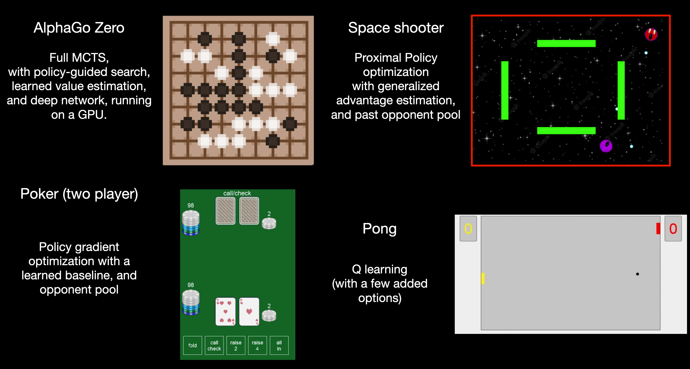

# RL-demonstrations
 A few reinforcement learning agent demonstrations, including AlphaGoZero, 
 Proximal Policy Optimization, and Q learning.

### The games

## Contents
1. The **MCTS-AlphaGoZero** folder contains an implementation of the AlphaGoZero algorithm 
on a 9x9 Go board, but otherwise using essentially all aspects of the original paper (https://doi.org/10.1038/nature24270).
   - The agent achieves medium human-level play, but has specific vulnerable strategies.
   - It was not trained in parallel (with multiple games at once), nor for multiple days.
2. The Policy-Gradients folder contains two implementations of optimizing a neural network using policy gradients.
   1. **Poker-Agent** is an agent trained to play two-person poker using policy gradients, an opponent pool, and
   masked action space.
   2. **PPO-Space-Shooter-Agent** is an agent trained with proximal policy optimization (PPO) 
   to play a two-person game called "Space Shooter", where two spaceships hide behind
   obstacles and can shoot bullets at each other, trying to explode the other ship.
3. The Q-Learning folder contains two implementations of Q learning with neural networks.
   1. **Pong-Agent** is a simple implementation solving the game Pong (two players bounce a ball back and forth
   and try to not let it go out the end of the board).
   2. **Cartpole-Agent** is a simple network that learns to balance an inverted pendulum.

## How to run each example

Each example is generally structured in two stages:
1. Training: the agent is trained, and a model is checkpointed (saved).
2. Evaluation: the saved agent can be run, either in self play, or against a human opponent.

To run each agent, you will likely need to follow the following steps:
- Set up a local version of the folder containing the files, and install the relevant packages in python.
  - I've been using Pycharm with a local virtual environment. 
  - Relevant packages include: torch, numpy, tqdm, tensorboard, pygame
  - In pycharm, you can create a virtual environment, then sync the packages in the "requirements.txt" file
  in a few ways. Generally the relevant packages can be found in 
  the requirements.txt file of each folder.
- Set up the files for either training or evaluation of a trained model. 
  - Usually this means run something like "main.py"
- For details, see the README files within each subfolder.
  - Usually there is a README_game_mechanics.md which is the readme provided with the original game description.
  - README.md is my own added comments on how to run the programs.

## Citations and Sources of these files
These files were all generated as part of completing an online 
reinforcement learning course called "Delta Academy" 
(see https://joindeltaacademy.com and https://github.com/Delta-Academy, though note this course may no longer exist, 
as the founders have pivoted to building language model-enabled products at https://www.superflows.ai/).

Each week, after learning new concepts, we would build a reinforcement learning agent and compete against
the other members of the class 

The games implemented in this 8 week course were (in order, with increasing difficulty): 
1. tic-tac-toe (look up tables and TD learning)
2. connect four (feature vectors)
3. othello (neural networks for feature vectors)
4. pong (Q learning)
5. poker (policy gradients)
6. space shooter (proximal policy optimization)
7. tron (Monte-Carlo tree search)
8. Go (full AlphaGoZero MCTS)

The main person I interacted with in this course was Henry Pulver: (Github: Henry-Pulver).
He is responsible for a decent amount of the code here, in particular through providing and explaining 
expert solutions to each game at the end of each week (these would usually be much more efficient and concise
than the implementations I made, though with similar outcomes).
* It's hard to disentangle what exactly I wrote, and what was written by the course at this point, but
it is generally true that: 
  * Essentially every aspect of the code relating to reinforcement learning 
  was independently generated by me in some form at some point along the way. 
  * In cases where expert solutions were provided after the fact, and where I have copied some of that code, 
  it is in no way substantially different from what I had originally (just cleaner). 
  
Here is a description in a bit more detail of the workflow of the course, to understand what work is mine or not.
* In general, the game mechanics were provided, along with some guidance and skeleton code 
for building the agents, but a majority of the design choices were made independently.
  * We were generally given basic code structure and the reinforcement learning environment to run a game, through 
  declaring a game environment, and stepping the environment with an action like "environment.step(action)", and so on.
* During each week, we would build and implement sub-components during the class, like a python Class that 
implements experience replay (sampling from past actions and rewards over the last few games).
  * As another example, we were given the skeleton code of the steps used within
  Monte-Carlo tree search (ie which functions to implement),
  but we had to actually implement each sub-function ourselves (while checking functionality 
  against unit tests along the way).
* Sometimes, an expert solution would have a new capability, like the introduction of an opponent pool 
to play against previous opponents (included in the poker expert solution). I didn't write this, but I did modify it and 
probe in detail how it could be altered to change behavior (ie understanding in detail the role of the exploration coefficient
in the opponent pool, and the number of opponents and how often they were generated).

